# skeleto-nn

Procedural character motion for **any skeleton**: people, dogs, cats, horses, birds, snakes. No animation clips, no per-situation scripts for locomotion: a body is a tree of bones with joint limits, masses and a few anatomical numbers, and one planner makes it walk, run, jump, climb, duck, react to blows and fall.

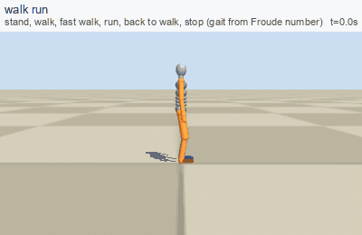

**The whole showcase (about 60 GIFs) is further down this page, grouped by topic; the same page as HTML is [`showcase/index.html`](showcase/index.html).**

## What is in it

* **A planner for legged bodies** (`planner.py`). Gait (walk, trot, canter, gallop) is picked from the Froude number, so a dwarf, a horse and a cat choose their own cadence. Feet are planted in the world and swing between footholds searched on the terrain (stairs, kerbs, logs are just terrain). The pelvis height is the highest the stance legs can reach (so it vaults and dips by itself), the trunk leans to keep the centre of mass over the feet (a belly, a pack or armour changes the posture without extra code), a ceiling lowers the body, a jump is a power-limited ballistic arc.
* **Anatomy as parameters** (`bodies.py`). Human: 3 lumbar + lower-thoracic + chest joints, clavicles, a toe bone in each foot. Quadrupeds: dog, cat, wolf, horse, pig differ in number of spine joints and range of the column, neck joints and nod, tail type (balance, wag, low, hair, curl), hoof or paw, hind-limb power for jumping. Birds, a snake. People differ by height, mass, leg ratio, belly, pack, armour, sex, and **outfit** (tight skirt, wide skirt, tight trousers, heavy boots, high heels, chainmail, plate: joint limits, extra mass, foot shape, stride and speed).
* **Goal-space skills** (`goals.py`, `posing.py`, `skills.py`): door, sit, lie in a bed, get up from the floor, ladder, ride, swim, dive. Goals for pelvis, hands and feet plus IK.
* **Combat as reactions** (`combat.py`, `hit.py`). A blow (stick, axe, arrow) is aimed at a body part. The defender notices it after its own delay and picks, by predicting the geometry and the pain, between duck, side step, step back, hop, block with a forearm, a shield or a lifted knee, or taking it. At impact the hit is resolved from the real positions. Pain per region (head, torso, groin, arms, legs, knees) makes an arm unusable (the hand clutches, a weapon is dropped), makes a leg limp, doubles the body over, or knocks it down; a blow to the groin is felt about three times less by a woman.
* **Limping and walking aids** (`aids.py`): a sore leg, a rigid stick instead of a lower leg, crutches with one leg held up, a dog on three legs.
* **Climbing where only some points can be held** (`climb.py`): three points of contact stay, the fourth limb reaches for a free hold in range.
* **Moves in clutter**: running into a wall with and without the arms up, running through a forest and through a crowd, squeezing between people.
* **A bone-injury model** (`injury.py`). A bone breaks when the force through it exceeds a tolerance, and it tolerates less when the load arrives fast. A body that yields while it stops spreads the same momentum over a longer stroke: lower peak force, lower rate, lower risk. The head has the lowest tolerance and the highest weight. This one score drives everything that is learned or evolved here: the fall and landing reflex, the slope-slide controller, the PPO reward, and the choice of a reaction.
* **A physical body** (`physics.py`, MuJoCo): the same skeleton as a torque-limited PD ragdoll. `reflex.py` evolves (CMA-ES) a small fall and landing controller against the injury score. Knock-downs in the demos are played from this physical fall.

## Honest status

| Part | How it is made | State |
|---|---|---|
| Walk, run, stairs, slopes, ducking, navigation, jumping, crowds, forest | planner, emergent from body and terrain | works, stick-figure level polish |
| Door, chair, bed, floor, ladder, ride | goals + IK | works, scripted goal sequences |
| Swimming, diving, bird flight and landings, snake | kinematic models | works, hand-built |
| Combat reactions, pain, limping, knock-downs | geometry + pain model + physical fall | works |
| Fall and landing reflex | physics, evolved on the injury score | see numbers below |
| Walking policy that tracks the planner under pushes (PPO) | physics, learned | **does not converge** without an assist harness (about two thirds of episodes fall when the assist is 0); code kept, no checkpoint shipped |

### Fall and landing reflex, 240 held-out shoves and drops (drops of 0.4 m to 2.6 m)

Mean fracture risk per region from the injury model (0 = none, 1 = certain); cost is the weighted score the controller was evolved on.

| controller | injury cost | head | torso | arms | legs |
|---|---|---|---|---|---|
| statue (stiff, no reflex) | 3.72 | 0.46 | 0.67 | 0.44 | 0.71 |
| hand-made starting pose | 3.81 | 0.55 | 0.48 | 0.73 | 0.53 |
| evolved on bone-injury score | 1.61 | 0.02 | 0.01 | 0.61 | 0.78 |

The evolved reflex nearly removes head and torso injury (risk 0.46 and 0.67 for a stiff body, 0.02 and 0.01 evolved). Arms and legs still take large peak forces: the legs carry 12 to 15 body weights in drops of 1 to 2.5 m against 34 to 66 for the stiff body, which is better but still above the leg tolerance of 10, so the limb columns stay high. That is the weak part and the next thing to improve.

### Standing on a slippery slope, 40 held-out slopes (8 to 25 degrees, friction 0.12 to 0.4)

| controller | stays up 5 s | mean time up | mean slide |
|---|---|---|---|
| stiff body, no controller | 0% | 1.1 s | 0.44 m |
| evolved controller | 20% | 1.8 s | 0.25 m |

A partial result: the evolved controller helps, most slopes still end in a fall.


## Showcase

Every GIF below is produced by `python catalog.py gif <name> out.gif`. The label says how the motion is made: **emergent** (general rules from the body and terrain), **goal script** (goals for pelvis, hands and feet + IK), **kinematic model** (hand-built), **physics, evolved**. The same page as HTML: [`showcase/index.html`](showcase/index.html).

### Walking, running and terrain (one planner, gait from the Froude number)

<table>
<tr><td width="50%" valign="top"><br><b>walk_run</b> <i>(emergent)</i><br>stand, walk, fast walk, run, back to walk, stop</td><td width="50%" valign="top">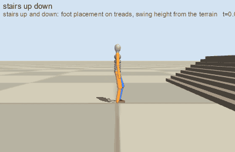<br><b>stairs_up_down</b> <i>(emergent)</i><br>stairs are just terrain: footholds searched, swing height from the terrain</td></tr>
<tr><td width="50%" valign="top">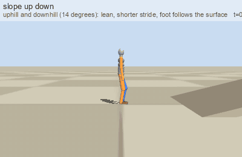<br><b>slope_up_down</b> <i>(emergent)</i><br>slopes: trunk pitch and foot rotation follow the ground normal</td><td width="50%" valign="top">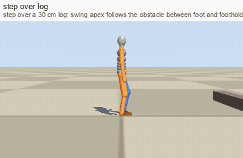<br><b>step_over_log</b> <i>(emergent)</i><br>step over a log</td></tr>
<tr><td width="50%" valign="top">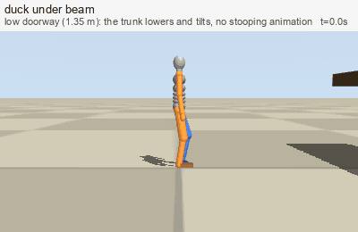<br><b>duck_under_beam</b> <i>(emergent)</i><br>auto-duck below a ceiling</td><td width="50%" valign="top">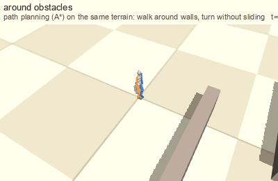<br><b>around_obstacles</b> <i>(emergent)</i><br>A* navigation around walls</td></tr>
<tr><td width="50%" valign="top">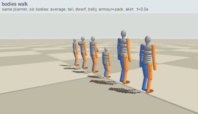<br><b>bodies_walk</b> <i>(emergent)</i><br>different bodies (tall, dwarf, belly, armour, pack, skirt) pick their own posture</td><td width="50%" valign="top">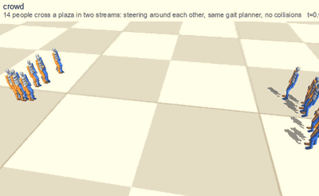<br><b>crowd</b> <i>(emergent)</i><br>14 people cross a plaza</td></tr>
<tr><td width="50%" valign="top">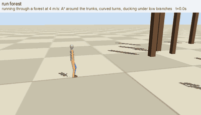<br><b>run_forest</b> <i>(emergent)</i><br>run through a forest: A* around trunks, duck under low branches</td><td width="50%" valign="top">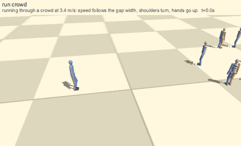<br><b>run_crowd</b> <i>(emergent)</i><br>run through a crowd: speed follows the gap, shoulders turn</td></tr>
<tr><td width="50%" valign="top">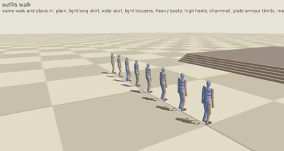<br><b>outfits_walk</b> <i>(emergent)</i><br>tight skirt, wide skirt, trousers, heavy boots, high heels, chainmail, plate: limits, mass, foot shape</td><td width="50%" valign="top">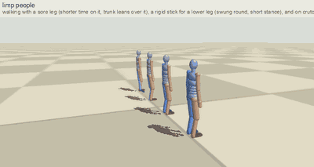<br><b>limp_people</b> <i>(emergent)</i><br>sore leg, rigid stick for a lower leg, crutches with one leg held up</td></tr>
<tr><td width="50%" valign="top">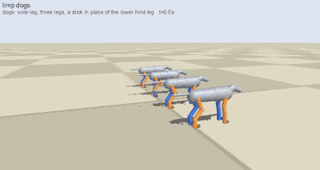<br><b>limp_dogs</b> <i>(emergent)</i><br>dog with a sore leg, on three legs, with a stick for the lower hind leg</td><td width="50%" valign="top">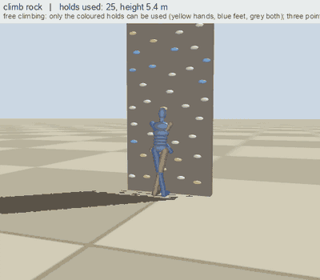<br><b>climb_rock</b> <i>(emergent)</i><br>rock face: only the coloured holds can be used</td></tr>
<tr><td width="50%" valign="top">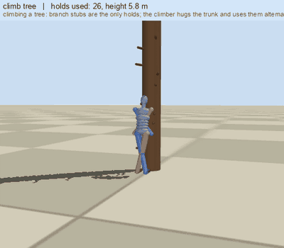<br><b>climb_tree</b> <i>(emergent)</i><br>tree: branch stubs are the only holds</td><td></td></tr>
</table>

### Jumping (power-limited: the planner refuses a jump the legs cannot make)

<table>
<tr><td width="50%" valign="top">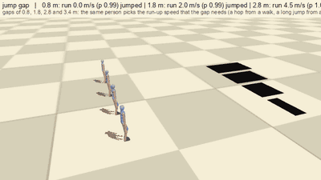<br><b>jump_gap</b> <i>(emergent)</i><br>1.2 m gap from a run-up</td><td width="50%" valign="top">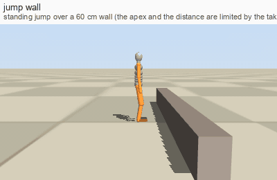<br><b>jump_wall</b> <i>(emergent)</i><br>standing jump over a 60 cm wall</td></tr>
<tr><td width="50%" valign="top">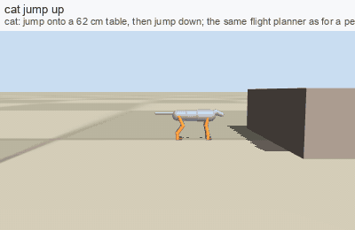<br><b>cat_jump_up</b> <i>(emergent)</i><br>cat: 8 spine joints coil, stretch, tuck, land</td><td width="50%" valign="top">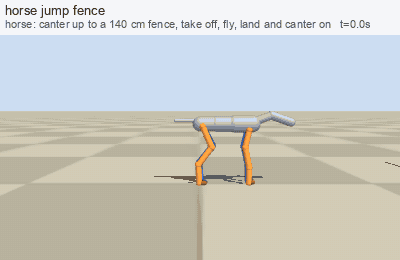<br><b>horse_jump_fence</b> <i>(emergent)</i><br>horse: stiff column, small trunk rotation</td></tr>
<tr><td width="50%" valign="top">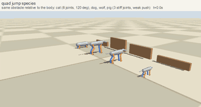<br><b>quad_jump_species</b> <i>(emergent)</i><br>same relative obstacle: cat, dog, wolf, pig</td><td></td></tr>
</table>

### Animals: spine, neck, tail and feet differ by species

<table>
<tr><td width="50%" valign="top">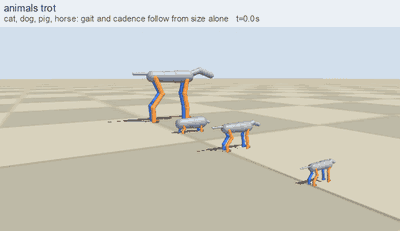<br><b>animals_trot</b> <i>(emergent)</i><br>dog, cat, horse, wolf, pig trot</td><td width="50%" valign="top">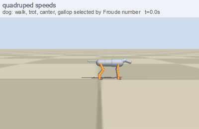<br><b>quadruped_speeds</b> <i>(emergent)</i><br>walk to gallop by Froude number</td></tr>
<tr><td width="50%" valign="top">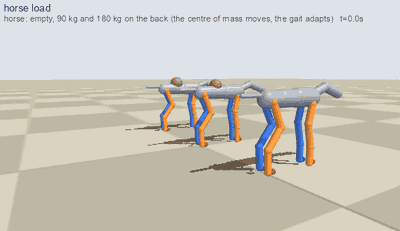<br><b>horse_load</b> <i>(emergent)</i><br>horse with 0, 90, 180 kg</td><td width="50%" valign="top">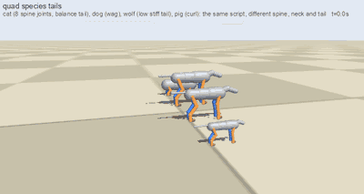<br><b>quad_species_tails</b> <i>(emergent)</i><br>balance tail, wag, low tail, curl</td></tr>
<tr><td width="50%" valign="top">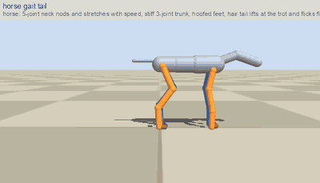<br><b>horse_gait_tail</b> <i>(emergent)</i><br>5-joint neck nod, hair tail flags and flicks</td><td width="50%" valign="top">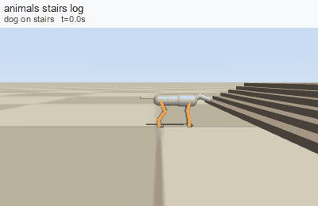<br><b>animals_stairs_log</b> <i>(emergent)</i><br>stairs and a log, four legs</td></tr>
</table>

### Birds and snake

<table>
<tr><td width="50%" valign="top">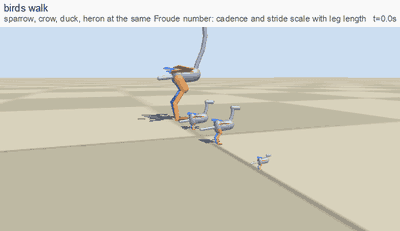<br><b>birds_walk</b> <i>(emergent)</i><br>bird gaits</td><td width="50%" valign="top">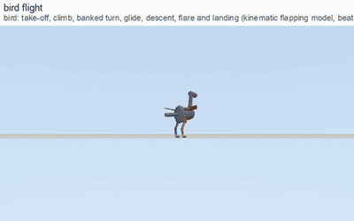<br><b>bird_flight</b> <i>(kinematic model)</i><br>flapping flight model (beat rate from mass)</td></tr>
<tr><td width="50%" valign="top">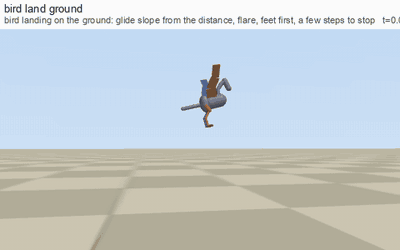<br><b>bird_land_ground</b> <i>(kinematic model)</i><br>landing on the ground: flare, feet first, run out</td><td width="50%" valign="top">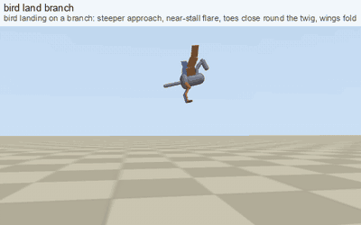<br><b>bird_land_branch</b> <i>(kinematic model)</i><br>landing on a branch: near-stall, toes grip</td></tr>
<tr><td width="50%" valign="top">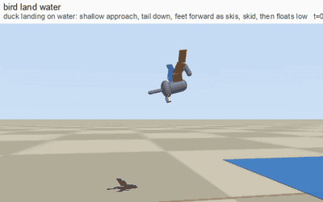<br><b>bird_land_water</b> <i>(kinematic model)</i><br>landing on water: skid and float</td><td width="50%" valign="top">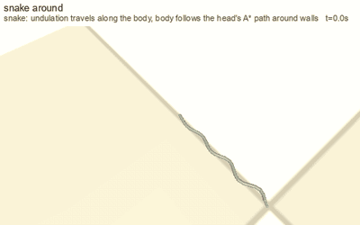<br><b>snake_around</b> <i>(kinematic model)</i><br>serpentine motion between walls</td></tr>
</table>

### Everyday situations (goals for pelvis, hands and feet + IK)

<table>
<tr><td width="50%" valign="top">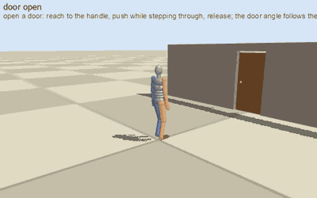<br><b>door_open</b> <i>(goal script)</i><br>open a door</td><td width="50%" valign="top">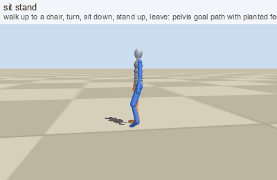<br><b>sit_stand</b> <i>(goal script)</i><br>sit on a chair and stand</td></tr>
<tr><td width="50%" valign="top">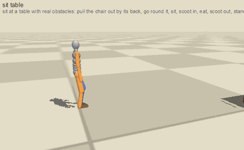<br><b>sit_table</b> <i>(goal script)</i><br>sit at a table</td><td width="50%" valign="top">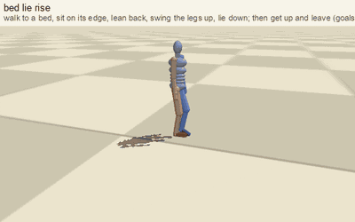<br><b>bed_lie_rise</b> <i>(goal script)</i><br>lie down in a bed, get up</td></tr>
<tr><td width="50%" valign="top">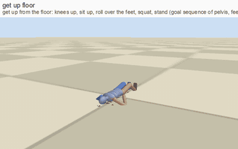<br><b>get_up_floor</b> <i>(goal script)</i><br>get up from the floor</td><td width="50%" valign="top">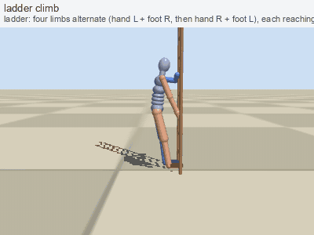<br><b>ladder_climb</b> <i>(goal script)</i><br>ladder</td></tr>
<tr><td width="50%" valign="top">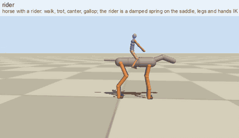<br><b>rider</b> <i>(goal script)</i><br>ride a horse</td><td width="50%" valign="top">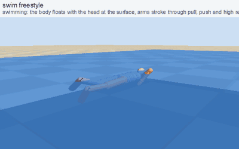<br><b>swim_freestyle</b> <i>(kinematic model)</i><br>swim, head above water</td></tr>
<tr><td width="50%" valign="top">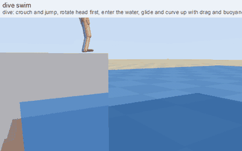<br><b>dive_swim</b> <i>(kinematic model)</i><br>dive</td><td width="50%" valign="top">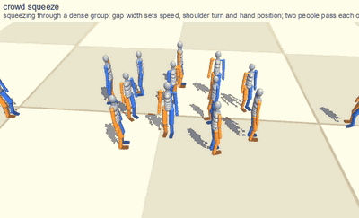<br><b>crowd_squeeze</b> <i>(emergent)</i><br>squeeze through people: shoulders turn, hands go up</td></tr>
<tr><td width="50%" valign="top">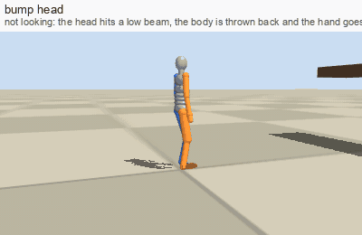<br><b>bump_head</b> <i>(emergent)</i><br>hit the head on a beam</td><td></td></tr>
</table>

### Combat as a set of reactions (no scripted duel)

<table>
<tr><td width="50%" valign="top">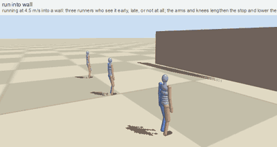<br><b>run_into_wall</b> <i>(emergent)</i><br>run into a wall: seen early, late, not at all (arms and knees lengthen the stop)</td><td width="50%" valign="top">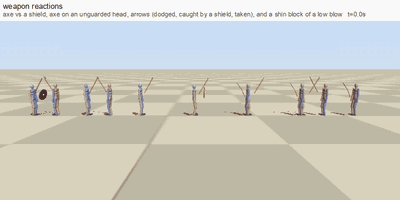<br><b>weapon_reactions</b> <i>(emergent)</i><br>axe vs shield, axe on a bare head, arrows dodged, caught by a shield, taken; shin block</td></tr>
<tr><td width="50%" valign="top">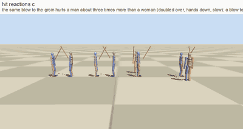<br><b>hit_reactions_c</b> <i>(physics, evolved)</i><br>groin (man vs woman) and knee</td><td width="50%" valign="top">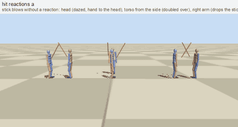<br><b>hit_reactions_a</b> <i>(emergent)</i><br>hit on head, torso, arm: stagger, doubled over, drop the weapon, clutch</td></tr>
<tr><td width="50%" valign="top">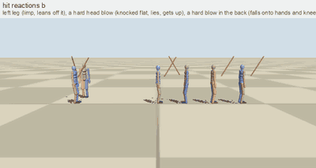<br><b>hit_reactions_b</b> <i>(physics, evolved)</i><br>leg: limp; hard head blow: physical fall, lie, get up; blow in the back</td><td width="50%" valign="top">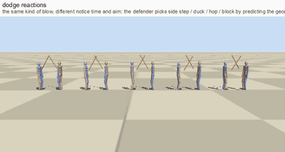<br><b>dodge_reactions</b> <i>(emergent)</i><br>notice in time: side step, duck, hop, block; too late: hit</td></tr>
<tr><td width="50%" valign="top">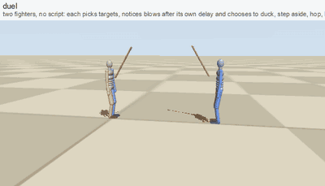<br><b>duel</b> <i>(emergent)</i><br>two fighters choose targets and reactions on their own</td><td width="50%" valign="top"><br><b>push_recovery</b> <i>(emergent)</i><br>shoved: recovery steps</td></tr>
</table>


## Run it

```bash
python3.11 -m venv .venv && source .venv/bin/activate
pip install -r requirements.txt
export MUJOCO_GL=glfw          # macOS; on Linux use egl or osmesa
python catalog.py list                         # all shots
python catalog.py gif walk_run runs/walk_run.gif
python catalog.py sheet duel runs/duel.png 8   # contact sheet
python make_showcase.py                        # rebuild runs/showcase/index.html from runs/gifs3
python tests/test_skeleton.py && python tests/test_physics.py   # planner FK equals MuJoCo FK
python reflex.py --gens 300 --pop 28 --procs 8 --out runs/reflex.json
python reflex_eval.py runs/reflex.json runs/reflex_eval
```

Needs ffmpeg for GIFs. Python 3.10+.

## Layout

| File | Role |
|---|---|
| `skeleton.py`, `bodies.py`, `ik.py` | bones, forward kinematics, parametric bodies and outfits, analytic IK |
| `planner.py`, `terrain.py`, `nav.py` | the walker, height-field terrain with ceilings and pits, A* |
| `goals.py`, `posing.py`, `skills.py`, `climb.py` | goal-space skills |
| `hit.py`, `combat.py`, `injury.py` | pain, knock-down, reactions, injury score |
| `physics.py`, `reflex.py`, `slide.py`, `env.py`, `train.py` | MuJoCo body, evolved controllers, PPO tracker |
| `shots.py`, `catalog*.py`, `render.py` | scenes and GIF rendering |
| `export_clip.py`, `bake_clip.py`, `bake_blender.py`, `retarget_blender.py`, `game_gif.py` | export: bake a motion into a glTF animation clip on your rigged character (Blender), or render it |

See [`docs/DESIGN.md`](docs/DESIGN.md) for how it works and where it is weak.

## From the planner to your engine

There is **no neural network in the runtime path.** The planner is an algorithm and the controllers that were learned or evolved are tiny parameter files: `results/reflex_fall.json` (48 numbers, the fall and landing reflex) and `results/slide_controller.json` (18 numbers). The PPO tracker in `train.py` is the only neural network; it did not converge and no weights are published.

To use a motion in an engine, bake it into an ordinary skeletal animation on your rigged character:

```bash
python bake_clip.py walk_run my_character.glb walk_run.glb      # needs Blender; edit MAP in bake_blender.py to your bone names
```

`bake_clip.py` simulates the shot (`export_clip.py` writes the world rotation of every bone per frame), retargets it onto the rig (trunk, legs and feet take the world rotation of the planner's skeleton, the arms take the direction of each segment) and writes a `.glb` with one animation of that name at 20 fps and one keyframe per bone per frame. Godot, Unity, Blender and three.js import it as an animation clip. Checked here: a 13 s walk bakes into a clip with 123 channels over 260 frames; it has not yet been played back inside a game engine. Reactive behaviours (fights, falls with a physical reflex, climbing) are baked the same way, one clip per situation; the decision logic itself stays in Python. Only the first character of a shot is baked (a duel gives one clip per fighter if you run it twice with a different actor index), and the bone map is for a humanoid rig; an animal rig needs its own `MAP`.

## Use it on your own rig

`bodies.py` describes a creature; `human_game_rig()` shows how the proportions of an existing rig are passed in. The planner outputs, per frame, world rotations of every bone; `retarget_blender.py` applies them to a rig by bone-name map (edit `MAP`). Nothing in the planner assumes a particular rig.

## License

MIT, see `LICENSE`.
