# skeleto-nn

Procedural character motion for **any skeleton**: people, dogs, cats, horses, birds, snakes. No animation clips and no script per situation for locomotion: a body is a tree of bones with joint limits, masses and a few anatomical and physiological numbers (muscle power, energy, flexibility, a heavy belly, clothing), and one planner makes it walk, run, jump, climb, duck, react to blows and fall. What is learned or evolved is always scored by one pain / bone-injury model.


**The whole showcase (about 90 GIFs) is further down this page, grouped by topic (people, jumping, climbing, fights, cat, dog, horse and rider, birds, water, physical falls); the same page as HTML is [`showcase/index.html`](showcase/index.html).**

## What is in it

* **A planner for legged bodies** (`planner.py`). Gait (walk, trot, canter, gallop) from the Froude number; feet planted in the world and swung between footholds searched on the terrain (stairs, kerbs, logs are just terrain; a pit is never stepped into); pelvis height from the reach of the stance legs; trunk lean that keeps the centre of mass over the feet (a belly, a pack or armour change posture on their own); ducking under a ceiling; pushes; turning limited by friction and by the size of the body (a horse swings wide, a cat turns on a coin); braking harder than speeding up.
* **Muscle, energy, flexibility** (`bodies.py`). `muscle` sets the jump and sprint power, `energy` the size of a reserve that drains with effort and refills at rest (a tired body slows and jumps less; a body with surplus energy spends it in hops), `flex` the joint ranges. Personas: child, adult, elder, starved, athlete, pregnant (`PERSONAS`). Weak bodies stand stooped, take short steps and rest on both feet; pregnancy adds a belly, a hollow back, a wide careful stance, a waddle and slower steps.
* **Anatomy as parameters.** Human: five trunk joints, clavicles, a toe bone in each foot. Quadrupeds: dog, cat, wolf, horse, pig, goat differ in the number of spine joints and the range of the column, neck joints and nod, tail type (balance, wag, low, hair, curl), hoof or paw, hind-limb power, turning radius. Birds, a snake. Outfits (tight or wide skirt, trousers, heavy boots, high heels, chainmail, plate) change joint limits, mass and foot shape.
* **Jumping that knows its limits** (`jumper.py`). A jump is a ballistic arc whose take-off speed is limited by the muscles; a run-up adds speed. The agent keeps a belief about its own capacity, learns it by practising on flat ground, and weighs the pain of failing (grows with the depth below) against a detour: it runs up and jumps, is afraid and stops at the edge, or - when over-confident - runs and is refused at the take-off. `ObstacleRunner` runs over rough ground and decides for each thing ahead: step over, jump a pit, hop, vault with the hands on top, go round, stop. `FenceJumper` does the same for a horse.
* **Goal-space skills** (`goals.py`, `posing.py`, `skills.py`, `catalog_hang.py`): door, chair, table (the chair is pulled out by its back, the table blocks the body), bed, floor, ladder, rider, pull-ups on a bar, a pipe and rings, mounting a ledge, climbing a rope. Goals for pelvis, hands and feet plus IK.
* **Climbing where only some points can be held** (`climb.py`): three points of contact stay, the fourth limb reaches for a free hold in range; the legs may not cross.
* **Combat as reactions** (`combat.py`, `hit.py`). Stick, axe or arrow aimed at a body part; the defender notices after its own delay and chooses by expected pain between duck, side step, step back, hop, forearm, shield or lifted knee, or taking it. Pain per region (head, torso, groin, arms, legs, knees) makes an arm unusable, a leg limp, doubles the body over or knocks it down; the fall is a physical simulation with an evolved reflex and the get-up starts from the pose it ended in.
* **Blows with different weapons and limbs, and bites and paws** (`combat.py`, `catalog_attacks.py`): sword, axe, spear (a straight thrust) and fist go through the same reaction and pain model; a kick, a wolf's bite (the neck and head reach for the arm), a bear's paw and a horse's hoof are limb attacks that reach a point of the victim and apply a blow of the right strength to its pain model.
* **Limping and aids** (`aids.py`): a sore leg, a rigid stick for a lower leg, crutches with one leg held up, a dog on three legs.
* **Moves in clutter** (`catalog_moves.py`, `controls.py`): running into a wall with and without the arms up, through a forest and through a crowd, squeezing between people, starting a run from a squat (stand first, drive out, or a sprinter's start), and a stick input with inertia (brake, pivot, corner).
* **A bone-injury model** (`injury.py`). A bone breaks when the force through it exceeds a tolerance, and tolerates less when the load arrives fast. A body that yields while it stops spreads the same momentum over a longer stroke: lower peak force, lower risk. The head weighs most (the belly, for a pregnant body). This score drives everything learned or evolved: the fall and landing reflex (also a separate one for a pregnant body), the slope controller, the PPO reward, the swimmer's and the bird's landing, and the choice of a reaction.
* **Physical bodies in water and air** (`physics.py`, `water.py`, `swimmer.py`, `air.py`, `flier.py`): the same skeleton as a MuJoCo ragdoll; water gives buoyancy, drag and flat palms and soles that push on it, with an oxygen budget that is spent while the mouth is under water; air gives wings and tail as plates (lift, stall, drag). Strokes and flapping are found by CMA-ES. **These work as physics but the learned results are poor** (see below).

## Honest status

| Part | How it is made | State |
|---|---|---|
| Walk, run, stairs, slopes, ducking, turns, jumps, obstacle course, crowds, forest, starts, stick input | planner, emergent from body and terrain | works at stick-figure level |
| Jump distances, fear, personas, energy, pregnancy, outfits, limping | parameters + self-model | works |
| Door, chair, table, bed, floor, ladder, rider, pull-ups, mantle, rope | goals + IK | works, authored sequences |
| Swimming and diving shown with the head up, bird flight and landings, snake | hand-built kinematic models | works, hand-built |
| Combat reactions, pain, limping, knock-downs | geometry + pain model + physical fall | works |
| Fall and landing reflex (also pregnant) | physics, evolved on the injury score | head and torso protected; arms and legs still take large forces |
| Physical swimmer (surface with oxygen, under water to a goal) | physics, evolved | water model works; **the learned stroke is a poor flail that drifts**, goals are not reached |
| Physical bird (flight with an energy store, landing, take-off) | physics, evolved | air model works; **glides about 3 s, landing hits hard, take-off not learned** |
| Walking policy that tracks the planner under pushes (PPO) | physics, learned | **does not converge** without an assist harness; code kept, no checkpoint |

### Fall and landing reflex, 240 held-out shoves and drops (drops of 0.4 m to 2.6 m)

Mean fracture risk per region from the injury model (0 = none, 1 = certain); cost is the weighted score the controller was evolved on.

| controller | injury cost | head | torso | arms | legs |
|---|---|---|---|---|---|
| statue (stiff, no reflex) | 3.72 | 0.46 | 0.67 | 0.44 | 0.71 |
| hand-made starting pose | 3.81 | 0.55 | 0.48 | 0.73 | 0.53 |
| evolved on bone-injury score | 1.61 | 0.02 | 0.01 | 0.61 | 0.78 |

The evolved reflex nearly removes head and torso injury (risk 0.46 and 0.67 for a stiff body, 0.02 and 0.01 evolved). Arms and legs still take large peak forces: the legs carry 12 to 15 body weights in drops of 1 to 2.5 m against 34 to 66 for the stiff body, which is better but still above the leg tolerance of 10, so the limb columns stay high. That is the weak part and the next thing to improve.

### Standing on a slippery slope, 40 held-out slopes (8 to 25 degrees, friction 0.12 to 0.4)

| controller | stays up 5 s | mean time up | mean slide |
|---|---|---|---|
| stiff body, no controller | 0% | 1.1 s | 0.44 m |
| evolved controller | 20% | 1.8 s | 0.25 m |

A partial result: the evolved controller helps, most slopes still end in a fall.

### The same falls for a heavily pregnant body (120 held-out shoves and drops; the belly weighs most in the score)

| controller | injury cost | belly | head | torso | arms | legs |
|---|---|---|---|---|---|---|
| stiff body | 9.49 | 0.61 | 0.48 | 0.48 | 0.40 | 0.57 |
| general reflex | 7.11 | 0.55 | 0.02 | 0.00 | 0.50 | 0.81 |
| reflex evolved for this body | 2.68 | 0.07 | 0.08 | 0.19 | 0.58 | 0.69 |

A reflex evolved for this body keeps the belly off the ground (risk 0.07 against 0.55 for the general reflex) without giving up the head.


## Showcase

Every GIF below is produced by `python catalog.py gif <name> out.gif`. The label says how the motion is made: **emergent** (general rules from the body and terrain), **goal script** (goals for pelvis, hands and feet + IK), **kinematic model** (hand-built), **physics, evolved**. The same page as HTML: [`showcase/index.html`](showcase/index.html).

### People: walking, running, terrain, obstacles (one planner, gait from the Froude number)

<table>
<tr><td width="50%" valign="top"><br><b>walk_run</b> <i>(emergent)</i><br>stand, walk, fast walk, run, back to walk, stop</td><td width="50%" valign="top"><br><b>stairs_up_down</b> <i>(emergent)</i><br>stairs are just terrain (the steps span the whole width: the only way is over)</td></tr>
<tr><td width="50%" valign="top"><br><b>slope_up_down</b> <i>(emergent)</i><br>slopes: trunk pitch and foot rotation follow the ground</td><td width="50%" valign="top"><br><b>step_over_log</b> <i>(emergent)</i><br>step over a log</td></tr>
<tr><td width="50%" valign="top"><br><b>duck_under_beam</b> <i>(emergent)</i><br>auto-duck below a ceiling</td><td width="50%" valign="top">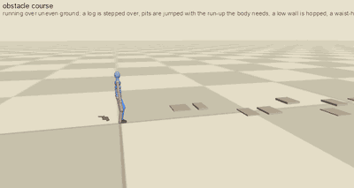<br><b>obstacle_course</b> <i>(emergent)</i><br>uneven ground, a log, pits (jumped with the run-up the body needs), a low wall, a waist-high wall (vaulted), a wall that is too high (gone round), a pit that is too wide (stops, afraid)</td></tr>
<tr><td width="50%" valign="top"><br><b>around_obstacles</b> <i>(emergent)</i><br>A* around walls</td><td width="50%" valign="top"><br><b>run_forest</b> <i>(emergent)</i><br>run through a forest, duck under branches</td></tr>
<tr><td width="50%" valign="top"><br><b>run_crowd</b> <i>(emergent)</i><br>run through a crowd</td><td width="50%" valign="top"><br><b>crowd</b> <i>(emergent)</i><br>14 people cross a plaza</td></tr>
<tr><td width="50%" valign="top"><br><b>crowd_squeeze</b> <i>(emergent)</i><br>squeeze through people: shoulders turn, hands go up</td><td width="50%" valign="top"><br><b>run_into_wall</b> <i>(emergent)</i><br>run into a wall: seen early, late, not at all</td></tr>
<tr><td width="50%" valign="top">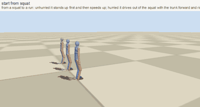<br><b>start_from_squat</b> <i>(emergent)</i><br>from a squat to a run: stand first, drive out, or a sprinter&#x27;s start</td><td width="50%" valign="top">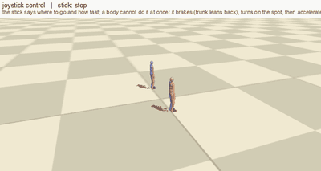<br><b>joystick_control</b> <i>(emergent)</i><br>stick input with inertia: brake, pivot, corner, accelerate</td></tr>
<tr><td width="50%" valign="top"><br><b>push_recovery</b> <i>(emergent)</i><br>shoved: recovery steps</td><td></td></tr>
</table>

### People: muscle, energy, flexibility, age, pregnancy, clothing, injury

<table>
<tr><td width="50%" valign="top"><br><b>bodies_walk</b> <i>(emergent)</i><br>tall, dwarf, belly, armour, pack, skirt</td><td width="50%" valign="top">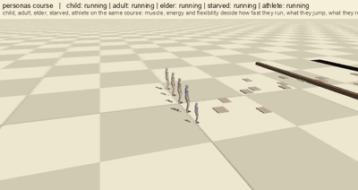<br><b>personas_course</b> <i>(emergent)</i><br>child, adult, elder, starved, athlete on the same course: what each jumps, vaults, refuses</td></tr>
<tr><td width="50%" valign="top">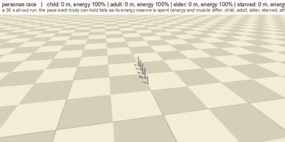<br><b>personas_race</b> <i>(emergent)</i><br>a 36 s all-out run: the reserve of energy sets the pace that can be held</td><td width="50%" valign="top"><br><b>outfits_walk</b> <i>(emergent)</i><br>tight skirt, wide skirt, trousers, boots, heels, chainmail, plate</td></tr>
<tr><td width="50%" valign="top">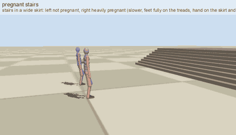<br><b>pregnant_stairs</b> <i>(emergent)</i><br>stairs in a skirt: not pregnant vs heavily pregnant</td><td width="50%" valign="top"><br><b>limp_people</b> <i>(emergent)</i><br>sore leg, rigid stick for a lower leg, crutches</td></tr>
<tr><td width="50%" valign="top"><br><b>bump_head</b> <i>(emergent)</i><br>hit the head on a beam</td><td></td></tr>
</table>

### Jumping: how far the body knows it can jump (self-model learned by practice, fear)

<table>
<tr><td width="50%" valign="top"><br><b>jump_gap</b> <i>(emergent)</i><br>gaps of 0.8, 1.8, 2.8 and 3.4 m: the run-up follows the gap</td><td width="50%" valign="top">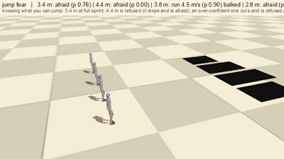<br><b>jump_fear</b> <i>(emergent)</i><br>knowing the limit: jumps 3.4 m, is afraid of 4.4 m, an over-confident one balks at the edge, an over-cautious one will not try</td></tr>
<tr><td width="50%" valign="top"><br><b>jump_wall</b> <i>(emergent)</i><br>standing jump over a wall</td><td></td></tr>
</table>

### Climbing and hanging

<table>
<tr><td width="50%" valign="top"><br><b>climb_rock</b> <i>(emergent)</i><br>rock face: only the coloured holds can be used</td><td width="50%" valign="top"><br><b>climb_tree</b> <i>(emergent)</i><br>tree: branch stubs are the only holds</td></tr>
<tr><td width="50%" valign="top"><br><b>ladder_climb</b> <i>(goal script)</i><br>ladder</td><td width="50%" valign="top">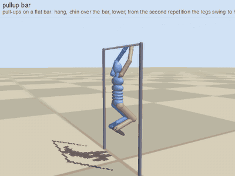<br><b>pullup_bar</b> <i>(goal script)</i><br>pull-ups on a bar, legs help</td></tr>
<tr><td width="50%" valign="top">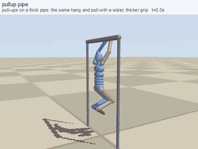<br><b>pullup_pipe</b> <i>(goal script)</i><br>pull-ups on a pipe</td><td width="50%" valign="top">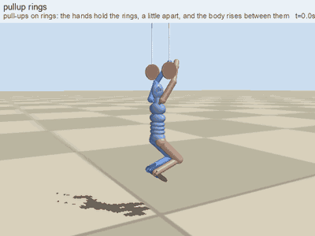<br><b>pullup_rings</b> <i>(goal script)</i><br>pull-ups on rings</td></tr>
<tr><td width="50%" valign="top">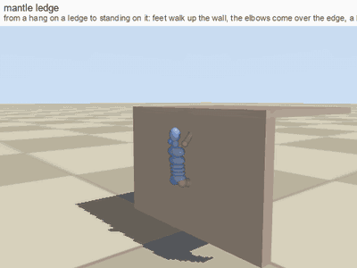<br><b>mantle_ledge</b> <i>(goal script)</i><br>from a hang to standing on a ledge</td><td width="50%" valign="top">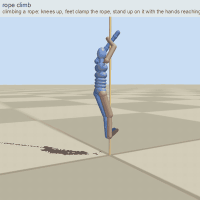<br><b>rope_climb</b> <i>(goal script)</i><br>climbing a rope with hands and feet</td></tr>
</table>

### Everyday situations

<table>
<tr><td width="50%" valign="top"><br><b>door_open</b> <i>(goal script)</i><br>open a door</td><td width="50%" valign="top"><br><b>sit_stand</b> <i>(goal script)</i><br>sit on a chair and stand</td></tr>
<tr><td width="50%" valign="top"><br><b>sit_table</b> <i>(goal script)</i><br>pull the chair out, sit, scoot in, eat, leave (table and chair are real obstacles)</td><td width="50%" valign="top"><br><b>bed_lie_rise</b> <i>(goal script)</i><br>lie in a bed, get up</td></tr>
<tr><td width="50%" valign="top"><br><b>get_up_floor</b> <i>(goal script)</i><br>get up from the floor</td><td width="50%" valign="top"><br><b>rider</b> <i>(goal script)</i><br>ride a horse (see the horse section)</td></tr>
</table>

### Blows, pain, reactions

<table>
<tr><td width="50%" valign="top"><br><b>hit_reactions_a</b> <i>(emergent)</i><br>hit on head, torso, arm: stagger, doubled over, drop the weapon, clutch</td><td width="50%" valign="top"><br><b>hit_reactions_b</b> <i>(physics, evolved)</i><br>leg: limp; hard head blow: physical fall, lie, get up</td></tr>
<tr><td width="50%" valign="top"><br><b>hit_reactions_c</b> <i>(physics, evolved)</i><br>groin (man vs woman) and knee</td><td width="50%" valign="top"><br><b>dodge_reactions</b> <i>(emergent)</i><br>notice in time: side step, duck, hop, block; too late: hit</td></tr>
<tr><td width="50%" valign="top"><br><b>weapon_reactions</b> <i>(emergent)</i><br>axe vs shield, axe on a bare head, arrows dodged, caught by a shield, taken; shin block</td><td width="50%" valign="top"><br><b>duel</b> <i>(emergent)</i><br>two fighters choose targets and reactions on their own</td></tr>
</table>

### Blows with different weapons and limbs; damage from animals

<table>
<tr><td width="50%" valign="top">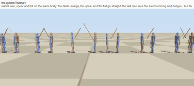<br><b>weapons_human</b> <i>(emergent)</i><br>sword, axe, spear and fist: swing or straight thrust, hit or dodged</td><td width="50%" valign="top">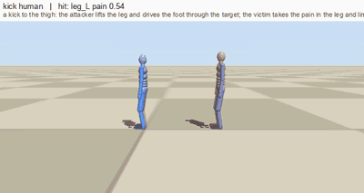<br><b>kick_human</b> <i>(emergent)</i><br>a kick to the thigh: the victim limps</td></tr>
<tr><td width="50%" valign="top">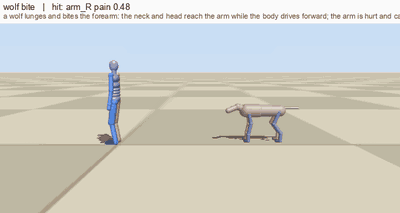<br><b>wolf_bite</b> <i>(emergent)</i><br>a wolf lunges and bites the forearm: the arm is hurt</td><td width="50%" valign="top">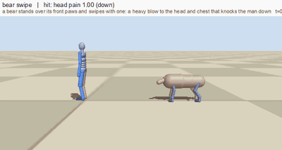<br><b>bear_swipe</b> <i>(emergent)</i><br>a bear&#x27;s paw swipe to the head: a knock-down</td></tr>
<tr><td width="50%" valign="top">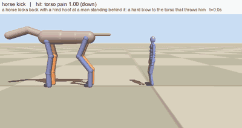<br><b>horse_kick</b> <i>(emergent)</i><br>a hind hoof kick: a hard blow to the torso</td><td></td></tr>
</table>

### Cat

<table>
<tr><td width="50%" valign="top"><br><b>cat_jump_up</b> <i>(emergent)</i><br>jump up and down: eight spine joints coil and stretch</td><td width="50%" valign="top">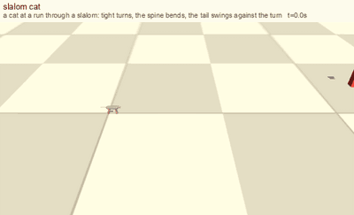<br><b>slalom_cat</b> <i>(emergent)</i><br>slalom: tight turns, balance tail</td></tr>
</table>

### Dog

<table>
<tr><td width="50%" valign="top">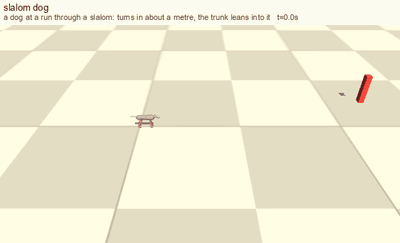<br><b>slalom_dog</b> <i>(emergent)</i><br>slalom at a run</td><td width="50%" valign="top"><br><b>limp_dogs</b> <i>(emergent)</i><br>sore leg, three legs, a stick for a lower leg</td></tr>
<tr><td width="50%" valign="top">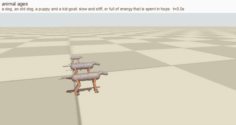<br><b>animal_ages</b> <i>(emergent)</i><br>old dog, puppy, kid goat</td><td></td></tr>
</table>

### Horse (and rider)

<table>
<tr><td width="50%" valign="top">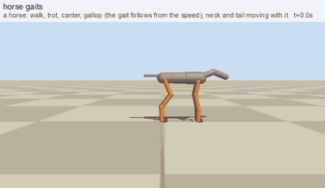<br><b>horse_gaits</b> <i>(emergent)</i><br>walk, trot, canter, gallop</td><td width="50%" valign="top">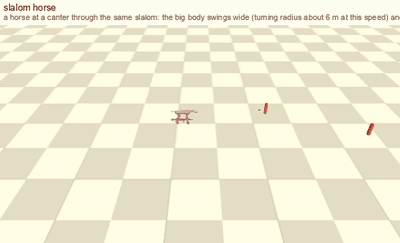<br><b>slalom_horse</b> <i>(emergent)</i><br>slalom: the big body swings wide</td></tr>
<tr><td width="50%" valign="top">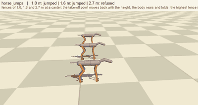<br><b>horse_jumps</b> <i>(emergent)</i><br>fences of 1.0, 1.6 and 2.7 m: jumps, jumps, refuses</td><td width="50%" valign="top"><br><b>horse_load</b> <i>(emergent)</i><br>with 0, 90, 180 kg on the back</td></tr>
<tr><td width="50%" valign="top"><br><b>horse_gait_tail</b> <i>(emergent)</i><br>5-joint neck nod, hair tail</td><td width="50%" valign="top"><br><b>rider</b> <i>(goal script)</i><br>rider on the saddle: walk to gallop</td></tr>
<tr><td width="50%" valign="top">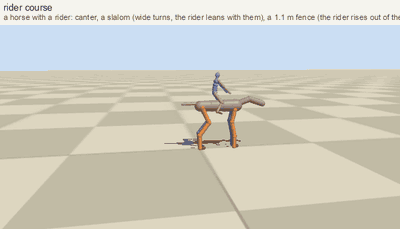<br><b>rider_course</b> <i>(goal script)</i><br>horse and rider: slalom and a fence</td><td></td></tr>
</table>

### Other animals, side by side

<table>
<tr><td width="50%" valign="top"><br><b>animals_trot</b> <i>(emergent)</i><br>dog, cat, horse, wolf, pig trot</td><td width="50%" valign="top"><br><b>quadruped_speeds</b> <i>(emergent)</i><br>walk to gallop by Froude number</td></tr>
<tr><td width="50%" valign="top"><br><b>quad_species_tails</b> <i>(emergent)</i><br>balance tail, wag, low tail, curl</td><td width="50%" valign="top"><br><b>quad_jump_species</b> <i>(emergent)</i><br>same relative obstacle: cat, dog, wolf, pig</td></tr>
<tr><td width="50%" valign="top"><br><b>animals_stairs_log</b> <i>(emergent)</i><br>stairs and a log, four legs</td><td></td></tr>
</table>

### Birds and snake

<table>
<tr><td width="50%" valign="top"><br><b>birds_walk</b> <i>(emergent)</i><br>bird gaits</td><td width="50%" valign="top"><br><b>bird_flight</b> <i>(kinematic model)</i><br>flapping flight model</td></tr>
<tr><td width="50%" valign="top"><br><b>bird_land_ground</b> <i>(kinematic model)</i><br>landing on the ground</td><td width="50%" valign="top"><br><b>bird_land_branch</b> <i>(kinematic model)</i><br>landing on a branch</td></tr>
<tr><td width="50%" valign="top"><br><b>bird_land_water</b> <i>(kinematic model)</i><br>landing on water</td><td width="50%" valign="top">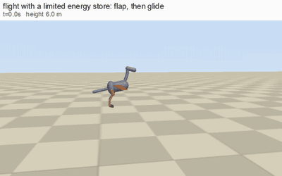<br><b>bird_fly</b> <i>(physics, evolved)</i><br>physical flight: wings and tail are plates in the air; gliding about 3 s (the stroke is not good yet)</td></tr>
<tr><td width="50%" valign="top">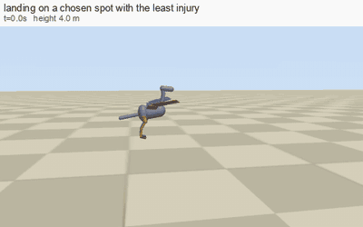<br><b>bird_land</b> <i>(physics, evolved)</i><br>physical landing: not solved (hits hard)</td><td width="50%" valign="top">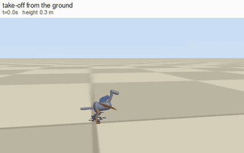<br><b>bird_takeoff</b> <i>(physics, evolved)</i><br>physical take-off: not learned</td></tr>
<tr><td width="50%" valign="top"><br><b>snake_around</b> <i>(kinematic model)</i><br>serpentine motion between walls</td><td></td></tr>
</table>

### Water

<table>
<tr><td width="50%" valign="top"><br><b>swim_freestyle</b> <i>(kinematic model)</i><br>swimming with the head above water (hand-built)</td><td width="50%" valign="top"><br><b>dive_swim</b> <i>(kinematic model)</i><br>diving (hand-built)</td></tr>
<tr><td width="50%" valign="top">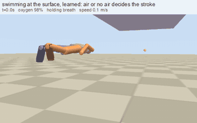<br><b>swim_surface</b> <i>(physics, evolved)</i><br>physical swimmer at the surface with an oxygen budget: a poor stroke, but it does breathe</td><td width="50%" valign="top">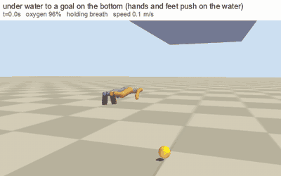<br><b>swim_under_bottom</b> <i>(physics, evolved)</i><br>physical swimmer to a goal on the bottom</td></tr>
<tr><td width="50%" valign="top">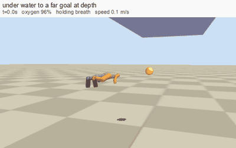<br><b>swim_under_far</b> <i>(physics, evolved)</i><br>physical swimmer to a far goal at depth</td><td></td></tr>
</table>

### Physical falls (MuJoCo, evolved on the bone-injury score)

<table>
<tr><td width="50%" valign="top">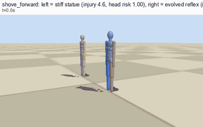<br><b>shove_forward</b> <i>(physics, evolved)</i><br>shove: stiff body vs evolved reflex</td><td width="50%" valign="top">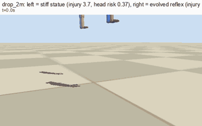<br><b>drop_2m</b> <i>(physics, evolved)</i><br>drop of 2 m</td></tr>
<tr><td width="50%" valign="top">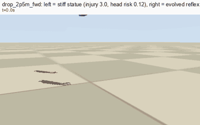<br><b>drop_2p5m_fwd</b> <i>(physics, evolved)</i><br>drop of 2.5 m with forward speed</td><td width="50%" valign="top">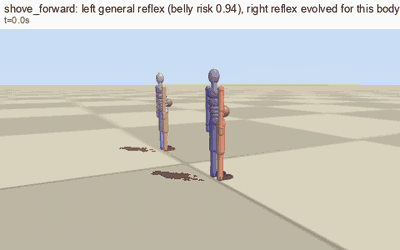<br><b>preg_shove_forward</b> <i>(physics, evolved)</i><br>pregnant: the general reflex vs the reflex evolved for this body (the belly is scored most)</td></tr>
<tr><td width="50%" valign="top">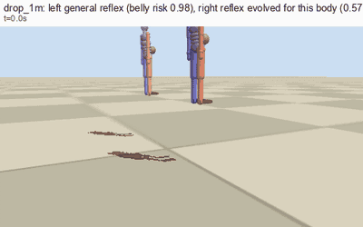<br><b>preg_drop_1m</b> <i>(physics, evolved)</i><br>pregnant: a drop</td><td width="50%" valign="top">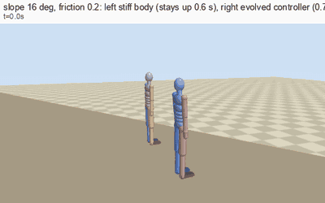<br><b>slide_slope</b> <i>(physics, evolved)</i><br>standing on a slippery slope</td></tr>
</table>


## Run it

```bash
python3.11 -m venv .venv && source .venv/bin/activate
pip install -r requirements.txt
export MUJOCO_GL=glfw          # macOS; on Linux use egl or osmesa
python catalog.py list                         # all shots
python catalog.py gif walk_run runs/walk_run.gif
python catalog.py sheet duel runs/duel.png 8   # contact sheet
python make_showcase.py                        # rebuild runs/showcase/index.html from runs/gifs3
for t in tests/test_*.py; do python $t; done   # planner FK equals MuJoCo FK, injury model, jumps, climbing, hits, aids, personas ...
python reflex.py --gens 300 --pop 28 --procs 8 --out runs/reflex.json
REFLEX_BODY=pregnant python reflex.py --gens 120 --init results/reflex_fall.json --out runs/reflex_preg.json
python swim_evolve.py under|surface --gens 250 --out runs/swim.json
python flier_evolve.py fly|land|takeoff --gens 250 --out runs/bird.json
```

Needs ffmpeg for GIFs. Python 3.10+.

## From the planner to your engine

There is **no neural network in the runtime path.** The planner is an algorithm and what was learned or evolved is small parameter files: `results/reflex_fall.json` (the fall and landing reflex), `results/reflex_fall_pregnant.json`, `results/slide_controller.json`. The PPO tracker in `train.py` is the only neural network; it did not converge and no weights are published.

To use a motion in an engine, bake it into an ordinary skeletal animation on your rigged character:

```bash
python bake_clip.py walk_run my_character.glb walk_run.glb      # needs Blender; edit MAP in bake_blender.py to your bone names
```

`bake_clip.py` simulates the shot (`export_clip.py` writes the world rotation of every bone per frame), retargets it onto the rig and writes a `.glb` with one animation at 20 fps and one keyframe per bone per frame. Godot, Unity, Blender and three.js import it as an animation clip. Checked: a 13 s walk bakes into a clip with 123 channels over 260 frames; it has not yet been played back inside a game engine. Only the first character of a shot is baked and the bone map is for a humanoid rig. The decision logic (fights, jumps, falls) stays in Python and produces one clip per situation.

## Layout

| File | Role |
|---|---|
| `skeleton.py`, `bodies.py`, `ik.py` | bones, forward kinematics, parametric bodies, personas and outfits, analytic IK |
| `planner.py`, `terrain.py`, `nav.py`, `controls.py` | the walker, height-field terrain with ceilings, pits and hidden solids, A*, stick input |
| `jumper.py`, `climb.py`, `aids.py` | self-model and fear, obstacle runner, fence jumper, starts, play; climbing; crutches |
| `goals.py`, `posing.py`, `skills.py`, `catalog_hang.py` | goal-space skills |
| `hit.py`, `combat.py`, `injury.py` | pain, knock-down, reactions, injury score |
| `physics.py`, `water.py`, `air.py`, `reflex.py`, `slide.py`, `swimmer.py`, `flier.py`, `env.py`, `train.py` | MuJoCo body, water and air, evolved controllers, PPO tracker |
| `shots.py`, `catalog*.py`, `render.py`, `phys_gifs.py` | scenes and GIF rendering |
| `export_clip.py`, `bake_clip.py`, `bake_blender.py`, `retarget_blender.py`, `game_gif.py` | export to a glTF animation clip (Blender), or render on a rig |

See [`docs/DESIGN.md`](docs/DESIGN.md) for how it works and where it is weak.

## License

MIT, see `LICENSE`.
