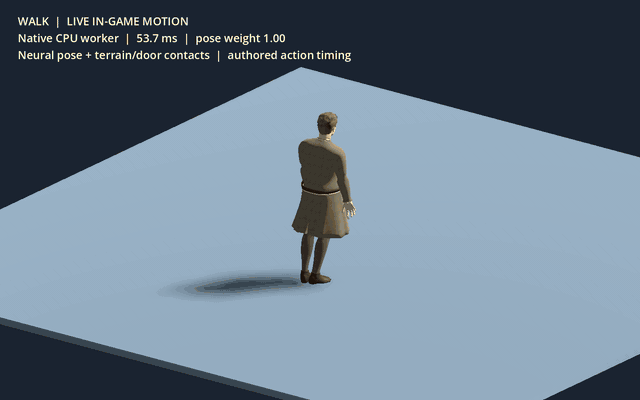

# ☠️ skeleto-nn

Neural network powered character motion for **any skeleton**: people, 🐕 🐈‍⬛ 🐎 🦅 🐍

A body is a tree of bones with joint limits, masses and a few anatomical and physiological numbers; what it does is
decided by small networks that are trained against the physical and physiological consequences of what they do
(injury, pain, strain, energy, fatigue, falls, heat loss, blood loss, wind), moving the body through its muscles.
The muscle-learning research uses motion references during training and muscle excitation in physics at runtime.
The new [native pretrained runtime](runtime/README.md) instead generates kinematic poses with NVIDIA MotionBricks
and scene goal constraints. It is the deployment path now integrated into Reval Rebel; muscle research stays separate.

| network | what it decides | inputs | weights | state |
|---|---|---|---|---|
| **Style network** (`adapt/`, [docs/ADAPT.md](docs/ADAPT.md)) | how a body moves in its situation: stride, crouch, lean, arms out or hugged, a hand on a wound, limp, shiver, wingbeat | body, 24 situation channels (friction, sinking feet, wetness, cold, wind, darkness, smoke, blood loss, pain per region, fatigue, load ...) | [`results/style_net.json`](results/style_net.json), MLP 31-64-64-24, about 7,800 weights | works: 99.9 % of a per-case optimisation; trained in about 25 s on a CPU |
| **Jump network** (`adapt/leap.py`, [docs/ADAPT.md](docs/ADAPT.md#jumping-by-context-adaptleappy)) | whether and how to jump: hop, vault with the hands, pull up onto a ledge, drop, jump into water, or refuse | the ground ahead as a profile (height and water depth every quarter leg length), body, the same 24 channels | [`results/leap_net.json`](results/leap_net.json), MLP scored per landing place, about 14,000 weights | works: 91 % of a per-case optimisation, 95 % the same jump-or-stay decision |
| **Native pretrained runtime** (`runtime/`, [build and protocol](runtime/README.md)) | live human locomotion and constrained jump/reach/ladder transitions | previous pose, velocity, facing, goal keyframes | external NVIDIA MotionBricks G1 weights, about 183M parameters | integrated into the game and exported on macOS arm64; no runtime Python or server |
| **Motor networks**, one per body family (`motor/`, [docs/MOTOR.md](docs/MOTOR.md)) | every joint, 30 times a second | body, environment, goal, the body's state, a motivation profile | none yet | research paused 2026-10-22; last measured results below; not deployed to the game |

The style and jump networks are trained on differentiable consequence models (fast and exact, but reduced-order);
the motor networks are trained by reinforcement learning in MuJoCo. Their forward passes are a few lines of code in
any language; a GDScript port runs both finished networks in the Reval Rebel game.

## Game integration (2026-10-25)

The [native pretrained runtime](runtime/README.md) now drives the hero in **Reval Rebel**.
The initial game integration was committed as `a29ac7d38`; the native runtime landed here in `a28ee77`.
The subsequent native stability fix is `81d4946`; the corrected game poses are shown below.
The muscle-training experiments below remain paused at their last measured state from 2026-10-22.



*Excerpts from a 76-second regression at the real 1.5 m/s city walk speed: 90/180-degree turns,
stairs, the actual smithy ladder, walking again and the 8 m/s authored sprint. The full city was checked separately
through its normal input path.*

The first version had real integration bugs: a turn during model startup was baked into the skeleton bind,
predicted root yaw competed with game heading, and repeated action goals accumulated joint angles.
The fix uses a rig-local bind, body-local commands, game-owned yaw, absolute neutral-relative goals and a fresh
context on mode changes. Playback now uses 30 FPS; stale foot contacts release before dragging the pelvis down.
No model weights were retrained. Sprinting uses its authored run clip: this bundle contains walking styles,
and the game no longer sends its 8 m/s sprint to that model.

| Operation | Current implementation |
|---|---|
| Standing, walking and changing pace | Live MotionBricks G1 pose generation on CPU, retargeted to the existing human rig. The 8 m/s city sprint uses the authored run clip; walking weights are not extrapolated to sprint speeds. |
| Uphill and stairs | Neural locomotion plus terrain sampling and two-bone foot IK; the game owns root movement and elevation. |
| Jump | Pretrained transitions toward takeoff, airborne and landing goals, blended with the existing clips and game phase clock. |
| Open a door | A reaching goal plus hand IK targeting the actual ring on the swinging leaf; no automatic approach from outside arm reach. |
| Rung ladder | Alternating arm/leg goals and four contact targets; the first fixed ladder reaches the smithy's existing loft, with ascent, descent and boarding. City-wide placement is still pending. |

This is **kinematic neural animation with clips and IK**, not learned muscle physics. The game retains collision,
action timing, stamina and saves. Authored clips keep head/finger channels and take over for combat, swimming
and riding. Missing runtime assets or late inference preserve clip playback and the available contact corrections.

Verified on **macOS arm64, Apple M5 Pro, two CPU threads**:

- 64 focused Godot tests passed, including startup turns, all facing combinations, slope-frame consistency, foot-contact release and frame-rate checks.
- A 256-plan real-weight regression passed across walking, repeated ladder/door/jump goals and walking again; the 76-second game-rig audit recorded no facing/tilt violations.
- All six native protocol modes passed real-weight checks, including malformed-request recovery; three packaging tests passed.
- The real city completed `E → climb → loft → E → descend` with active native ladder poses: 1,306 pose samples, no facing/tilt violations.
- The corrected exported `.app` loaded weights from `Contents/Resources/neural_runtime` and passed a smoke check that turns the hero before model readiness and measures the final body pose.
- Initial warmed capture samples were 44–97 ms per inference. Concurrent heavy builds also produced delays above one second;
  these samples are not a whole-game performance guarantee, and short action phases can finish before a neural reply.

The complete game suite is not green: existing release-artifact and city-fixture failures were recorded separately.
The pretrained model uses its specific NVIDIA license; the runtime packages the required license and attribution files.
See [build, deployment, protocol and licensing](runtime/README.md) for the reproducible path.

## How the bodies move

The motor networks do not turn joints: they excite muscles. Every limb and the trunk are moved by line muscles
(`muscles.py`) that run from an origin to an insertion on the bones, over wrapping surfaces at the joints (femoral
head, kneecap, condyles, the point of the hock, the bird's triosseal canal), and pull with Hill's force: activation
(10 ms up, 40 ms down), force-length, force-velocity, and the passive stretch of a long muscle. Moment arms follow
from the geometry and change with the angle; two-joint muscles (hamstrings, rectus femoris, gastrocnemius, biceps,
triceps, the digital flexors) tie their joints together as in a body. Each muscle's strength is its share of the
joint's, and a quadruped's legs are scaled to an estimate from muscle mass and fibre length: a dog's hind leg about 40
body weights of force, its fore leg 30, a cat's 95 and 60, a horse's 20 and 12. Line width in the atlases goes with
strength (diameter ~ square root of force). `python muscle_check.py` and `tests/test_muscles.py` check that every
muscle pulls its joint the anatomical way over the range; the atlases come from the physics model itself
(`python muscle_atlas.py`).

## People

### Muscles

<br><b>22 muscles per side</b>: legs, trunk, shoulder, arm

<br>Each muscle on its own: the body pinned by the pelvis, the muscle excited and let go; red and thick while it contracts, pale and thin when relaxed. No network involved.

### Motor network

<!-- motor-status:biped:start -->
**Current network** (`python -m motor.showcase`, updated 2026-10-22 10:07): 68,460 training iterations, score 0.88 of 1.3 (survival share x (0.3 + goal)); 44 line muscles, no harness.

<table><tr>
<td width="25%" valign="top"><br><b>walk 0.8 m/s</b>: held 8.0 s, 0.73 m/s, goal 0.84</td>
<td width="25%" valign="top"><br><b>walk 1.3 m/s</b>: held 8.0 s, 1.00 m/s, goal 0.70</td>
<td width="25%" valign="top"><br><b>walk to the left</b>: fell at 2.0 s, 0.82 m/s, goal 0.24</td>
<td width="25%" valign="top"><br><b>standing still</b>: held 8.0 s, 0.02 m/s, goal 0.94</td>
</tr></table>


Activation of every left-side muscle through the walk above (like an EMG), with the foot contacts below.
<!-- motor-status:biped:end -->

### Style network: ground, weather, injury and state

The style network sets how a body moves in its situation. In these GIFs its output drives the procedural walker of this repository; that walker no longer runs anything itself and serves the motor networks only as a training reference.

<table>
<tr><td width="50%" valign="top"><br><b>adapt_ground</b><br>dry, wet cobbles, mud, deep snow, ice, wet ice</td><td width="50%" valign="top"><br><b>adapt_injury</b><br>bleeding thigh and chest, sprain, broken arm, bruised ribs, drunk, exhausted</td></tr>
<tr><td width="50%" valign="top"><br><b>adapt_weather</b><br>frost, gale from the side, headwind, night, smoke</td><td width="50%" valign="top"><br><b>adapt_rain_cold</b><br>rain soaks the body, the core cools, the network answers (body time 40x)</td></tr>
<tr><td width="50%" valign="top"><br><b>adapt_bleed_time</b><br>a cut at 1 s: hand to the wound, blood lost grows (body time 20x)</td><td width="50%" valign="top"><br><b>adapt_unseen</b><br>conditions written after training, and combinations</td></tr>
</table>

### Jump network: what a 58 kg teenager does in front of ...

`python -m adapt.leap --probe` (each cell is the network's choice; the full table is in
[docs/ADAPT.md](docs/ADAPT.md#jumping-by-context-adaptleappy)):

| ahead | normal | ice | sprained ankle | heavy load |
|---|---|---|---|---|
| wall 0.85 m | vault, hands on the top | refuse | refuse | refuse |
| wall 1.3 m | vault | refuse | refuse | refuse |
| ledge 1.4 m | pull up | refuse | pull up | refuse |
| drop 1 m | drop, knees give | refuse | drop | drop |
| drop 2.5 m or 6 m onto stone | refuse | refuse | refuse | refuse |
| quay over deep water, summer | jump in | refuse | jump in | refuse |
| cliff over shallow water | refuse | refuse | refuse | refuse |

## Four-legged animals

### Muscles

<br><b>quadrupeds</b>: 11 per leg, back, belly and tail; the hind legs push, the fore legs carry; joint ranges from goniometry (a dog's stifle bends 42 to 162 degrees)

<br>Each muscle on its own: the body pinned by the pelvis, the muscle excited and let go; red and thick while it contracts, pale and thin when relaxed. No network involved.

### Motor network

One network for dog, cat, wolf, goat, horse, pig and bear on one canonical skeleton. A cat is also dropped upside
down from 2 to 5 body lengths and has to land on its feet, turning with its spine and tail.

<!-- motor-status:quadruped:start -->
**Current network** (`python -m motor.showcase`, updated 2026-10-22 10:07): 72,980 training iterations, score 0.23 of 1.3 (survival share x (0.3 + goal)); 66 line muscles, no harness.

<table><tr>
<td width="25%" valign="top"><br><b>dog, walk</b>: held 8.0 s, 0.75 m/s, goal 0.37</td>
<td width="25%" valign="top"><br><b>cat, walk</b>: fell at 1.3 s, 0.92 m/s, goal 0.25</td>
<td width="25%" valign="top"><br><b>horse, walk</b>: fell at 1.2 s, 2.13 m/s, goal 0.32</td>
<td width="25%" valign="top"><br><b>cat dropped upside down</b>: fell at 0.5 s, 0.45 m/s, goal 0.72</td>
</tr></table>


Activation of every left-side muscle through the walk above (like an EMG), with the foot contacts below.
<!-- motor-status:quadruped:end -->

### Style network

<table>
<tr><td width="50%" valign="top"><br><b>adapt_animals</b><br>dog on ice and in snow, soaked cat, horse in mud, lame horse</td><td></td></tr>
</table>

## Birds

### Muscles

<br><b>birds</b>: the pectoralis pulls the wing down; the supracoracoideus, under it on the keel, lifts the wing through a pulley over the shoulder

<br>Each muscle on its own: the body pinned by the pelvis, the muscle excited and let go; red and thick while it contracts, pale and thin when relaxed. No network involved.

### Motor network

Crow, gull, heron, sparrow and duck. Birds still fly on joint torques (the bird muscles are drawn but not yet in the
flight environment); the old procedural flap-and-glide flight is the style reference.

<!-- motor-status:bird:start -->
**Current network** (`python -m motor.showcase`, updated 2026-10-21 23:04): 100,590 training iterations, score 0.13 of 1.3 (survival share x (0.3 + goal)); joint torques, shown with the 3% harness it still trains with (it carries part of the weight and keeps the pelvis upright).

<table><tr>
<td width="25%" valign="top"><br><b>crow, level flight</b>: fell at 1.7 s, height 5.1 → 0.5 m, 9.4 m/s, goal 0.40</td>
<td width="25%" valign="top"><br><b>crow, turn</b>: fell at 1.5 s, height 4.9 → 0.3 m, 9.6 m/s, goal 0.41</td>
<td width="25%" valign="top"><br><b>crow, climb</b>: fell at 1.5 s, height 5.2 → 0.5 m, 9.5 m/s, goal 0.40</td>
<td width="25%" valign="top"><br><b>gull</b>: fell at 1.7 s, height 8.9 → 0.9 m, 8.7 m/s, goal 0.24</td>
</tr></table>
<!-- motor-status:bird:end -->

### Style network

<table>
<tr><td width="50%" valign="top"><br><b>adapt_birds_ground</b><br>crow on ice (wings out), soaked, hurt foot</td><td width="50%" valign="top"><br><b>adapt_birds_flight</b><br>calm, wet plumage, headwind, tailwind, carrying prey, hurt wing</td></tr>
</table>

## Status

| part | state |
|---|---|
| Style network for people, quadrupeds and birds | works; 99.9 % of per-case optimum on held-out cases; tests |
| Jump network for people and quadrupeds | works; 91 % of per-case optimum, 95 % same decision; numpy equals torch; tests |
| Evaluation system (`motor/evaluate.py`): injury, pain, strain, energy, fatigue, balance, gaze | works; each term responds to its own consequence (tests) |
| Line muscles (`muscles.py`): Hill model, wraps, two-joint muscles, strength from muscle mass | works for people, quadrupeds and birds; attachments checked over the joint ranges (tests) |
| Motion prior (`motor/amp.py`): recorded human motion, the old procedural gaits and flight as references | works in training |
| People motor network (muscles) | walks under a 30 % harness; learning to stand straight on its own muscles rather than its ligaments |
| Quadruped motor network (muscles) | dog, cat and horse walk under a 30 % harness; cat drop landings in training |
| Bird motor network | crow flies on its own; flight style from the reference; muscles not yet in flight |
| Mixed-body (monkey, bear on two legs, kangaroo, penguin) and snake motor networks | not started |
| A distilled pose network that a game runs without physics | not started |

## Run it

```bash
python3.11 -m venv .venv && source .venv/bin/activate
pip install -r requirements.txt
export MUJOCO_GL=glfw                           # macOS; on Linux use egl or osmesa

python -m adapt.train                           # style network (about 25 s, CPU); --init FILE --steps 800 to warm start
python -m adapt.train --check                   # against per-case optimal styles on held-out cases
python -m adapt.probe --body dog                # what the network does in named situations
python -m adapt.leap                            # jump network (about 12 min, CPU); --check, --probe
python -m adapt.export_engine OUT_DIR           # weights, condition registry and golden vectors for ports

python -m motor.pbt --family biped --name biped_pbt --members 3 --workers 3   # population training (also --family quadruped)
python -m motor.ppo --family biped --name biped --workers 15 --hours 4   # a single run
python -m motor.show runs/motor/biped/ckpt.pt [out_dir] [--assist 0.4]   # GIFs and summary.json, ten review situations

python -m pytest tests/test_adapt.py tests/test_leap.py tests/test_motor.py
```

Needs ffmpeg for GIFs. Python 3.10+.

## Using the networks in an engine

`python -m adapt.export_engine OUT_DIR` writes `style_net.json` and `leap_net.json` (weights with their input and
output schema), the condition registry, and golden vectors (inputs with the expected outputs) so that a port can be
checked number for number. A port is a matrix multiply, a tanh and a sigmoid per layer; see `adapt/net.py` for the
numpy version. The motor networks will be exported the same way once a policy works, as a distilled pose network
that needs no physics engine.

## Layout

| path | role |
|---|---|
| `adapt/` | style network and jump network: schema, conditions, consequence models, training, physiology, export ([docs/ADAPT.md](docs/ADAPT.md)) |
| `motor/` | motor networks: evaluation system, body-family environments, PPO, review renderer ([docs/MOTOR.md](docs/MOTOR.md)) |
| `results/` | trained weights (`style_net.json`, `leap_net.json`) |
| `showcase/` | GIFs of the style network (`adapt/`), the muscles and the current motor networks (`motor/`) |
| `tests/` | tests |

## License

MIT, see `LICENSE`.
